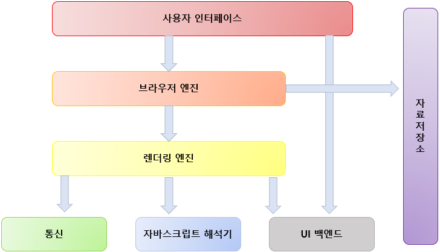

##

이 글은 NAVER D2에 있는 자료 “ 브라우저는 어떻게 동작하는가” 페이지를 Min-jyo가 공부하기 위해 정리한 자료입니다. 

출처 홈페이지는 이스라엘 개발자 탈리 가르시엘의  "[How](http://www.html5rocks.com/en/tutorials/internals/howbrowserswork/)[Browsers](http://www.html5rocks.com/en/tutorials/internals/howbrowserswork/)[Work](http://www.html5rocks.com/en/tutorials/internals/howbrowserswork/)[: ](http://www.html5rocks.com/en/tutorials/internals/howbrowserswork/)[Behind](http://www.html5rocks.com/en/tutorials/internals/howbrowserswork/)[the](http://www.html5rocks.com/en/tutorials/internals/howbrowserswork/)[scenes](http://www.html5rocks.com/en/tutorials/internals/howbrowserswork/)[of](http://www.html5rocks.com/en/tutorials/internals/howbrowserswork/)[modern](http://www.html5rocks.com/en/tutorials/internals/howbrowserswork/)[web](http://www.html5rocks.com/en/tutorials/internals/howbrowserswork/)[browsers](http://www.html5rocks.com/en/tutorials/internals/howbrowserswork/)" 홈페이지를 번역한 홈페이지 입니다.

##

# 브라우저는 어떻게 동작하는가?

이 글은 이스라엘 개발자 [탈리](http://taligarsiel.com/)[가르시엘](http://taligarsiel.com/)[(](http://taligarsiel.com/)[Tali](http://taligarsiel.com/)[Garsiel](http://taligarsiel.com/)[)](http://taligarsiel.com/)이 [html](http://html5rocks.com/)[5](http://html5rocks.com/)[rocks](http://html5rocks.com/)[.](http://html5rocks.com/)[com](http://html5rocks.com/)에 게시한 "[How](http://www.html5rocks.com/en/tutorials/internals/howbrowserswork/)[Browsers](http://www.html5rocks.com/en/tutorials/internals/howbrowserswork/)[Work](http://www.html5rocks.com/en/tutorials/internals/howbrowserswork/)[: ](http://www.html5rocks.com/en/tutorials/internals/howbrowserswork/)[Behind](http://www.html5rocks.com/en/tutorials/internals/howbrowserswork/)[the](http://www.html5rocks.com/en/tutorials/internals/howbrowserswork/)[scenes](http://www.html5rocks.com/en/tutorials/internals/howbrowserswork/)[of](http://www.html5rocks.com/en/tutorials/internals/howbrowserswork/)[modern](http://www.html5rocks.com/en/tutorials/internals/howbrowserswork/)[web](http://www.html5rocks.com/en/tutorials/internals/howbrowserswork/)[browsers](http://www.html5rocks.com/en/tutorials/internals/howbrowserswork/)"를 번역한 글입니다. 탈리 가르시엘은 몇 년간 브라우저 내부와 관련된 공개 자료를 확인하고, C++ 코드 수백만 줄 분량의 WebKit이나 Gecko 같은 오픈소스 렌더링 엔진의 소스 코드를 직접 분석하면서 어떻게 브라우저가 동작하는지 파악했습니다.

이 글은 Naver D2홈페이지의 내용을 정리한 내용입니다. 

https://d2.naver.com/helloworld/59361 

--------------------------------

### 이 글에서 설명하는 브라우저

	1. 파이어 폭스
 	2. 사파리
 	3. 크롬

------

### 브라우저의 주요 기능

1. 사용자가 선택한 **자원**을 서버에 요청
2. **브라우저에 표시하는것**

Tip 1. **자원**

보통은 HTML 문서지만 , PDF나 이미지 또는 다른 형태가 될수 있음

자원의 주소는 Url에 의해 정해짐

Tip 2. 브라우저는 **HTML과 CSS 명세**에 따라 HTML 파일을 해석해서 표시하는데 이 명세는 W3C에			서 정함 

Tip 2-1. 과거에는 브라우저들이 일부만 이 명세에 따라 구현하고 독자적인 방법을 확장함으로써 웹				제작자가 심각한 호환성 문제를 겪음

​				But !  최근에는 대부분 브라우저가 표준 명세를 따름

------

### 브라우저의 사용자 인터페이스 

- URl를 입력할 수 있는 주소 표시 줄
- 이전 버튼과 다음 버튼
- 북마크
- 새로 고침 버튼과 현재 문서의 로드를 중단할 수 있는 정지 버튼
- 홈 버튼

Tip 1. 브라우저의 사용자 인터페이스는 표준 명세가 없음에도 불구 서로의 장점을 모방 현재까지 이			르게됨. 

------

### 브라우저의 기본 구조

1. 사용자 인터페이스 - 주소 표시줄, 이전 / 다음 버튼, 북마크 메뉴 등, 요청한 페이지를 보여주는 창을 제외한 나머지 모든 부분이다.
2. 브라우저 엔진 - 사용자 인터페이스와 렌더링 엔진 사이의 동작을 제어
3. 렌더링 엔진 - 요청한 콘텐츠를 표시, 예를 들어 HTML을 요청하면 HTML과 CSS를 파싱하여 화면에 표시함
4. 통신 - HTTP 요청과 같은 네트워크 호출에 사용됨. 이것은 플랫폼 독립적인 인터페이스이고 각 플랫폼 하부에서 실행됨
5. UI 백엔드 - 콤보 박스와 창 같은 기본적인 장치를 그림. 플랫폼에서 명시하지 않은 일반적인 인터페이스로서, OS 사용자 인터페이스 체계를 사용
6. 자바스크립트 해석기 - 자바스크립트 코드를 해석하고 실행
7. 자료 저장소 : 이 부분은 자료를 저장하는 계층이다. 쿠키를 저장하는 것과 같이 모든 종류의 자원을 하드 디스크에 저장할 필요가 있다. HTML5 명세에는 브라우저가 지원하는 ‘웹 데이터 베이스’가 정의되어 있다. 

------

### 렌더링 엔진

역할 : 요청 받은 내용을 브라우저 화면에 **표시**하는 일이다.

​	-> 뭘 **표시**할까?

​		렌더링 엔진은 기본적으로 HTML 및 XML 문서와 이미지를 표시

​		플러그인이나 브라우저 확장 기능을 이용해 PDF와 같은 다른 유형도 표시 가능

------

### 각 브라우저가 쓰는 렌더링 엔진들

|   브라우저   |      렌더링 엔진       |
| :----------: | :--------------------: |
|  파이어폭스  | 게코(Gecko)엔진을 사용 |
| 사파리, 크롬 |   Webkit 엔진을 사용   |

------

### 렌더링 엔진의 동작 과정

렌더링 엔진은 통신으로부터 요청한 문서의 내용을 얻는 것으로 시작한다.

문서의 내용은 보통 8KB 단위로 전송된다.

순서 1 : 렌더링 엔진은 HTML 문서를 파싱하고 “콘텐츠 트리” 내부에서 태그를 DOM 노드를 변환한			다. 

순서 2 : 외부 CSS 파일과 함께 포함된 스타일 요소도 파싱한다. 

순서 3 : 스타일 정보와 HTML 표시 규칙은 “렌더 트리” 라고 부르는 또 다른 트리를 생성

순서 4 : 렌더 트리는 색상 또는 면적과 같은 시각적 속성이 있는 사각형을 포함하고 있는데 정해진 			순서대로 화면에 표시된다.

순서 5 : 렌더 트리 생성이 끝나면 배치가 시작되는데 이것은 각 노드가 화면의 정확한 위치에 표시되는것을 의미한다. 다음은 UI백엔드에서 렌더 트리의 각 노드를 가로지르며 형상을 만들어 내는 그리기 과정이다. 

일련의 과정들이 점진적으로 진행된다는 것을 아는 것이 중요하다. 렌더링 엔진은 좀 더 나은 사용자 경험을 위해 가능하면 빠르게 내용을 표시하는데 모든 HTML을 파싱할 때까지 기다리지 않고 배치와 그리기 과정을 시작한다. 네트워크로부터 나머지 내용이 전송되기를 기다리는 동시에 받은 내용의 일부를 먼저 화면에 표시하는 것이다. 

### 파싱과 DOM트리 구축

#### 문서 파싱

정의 : 문서 파싱은 브라우저가 코드를 이해하고 사용할 수 있는 구조로 변환하는 것을 의미한다.

문서 파싱의 결과 : 보통 문서 구조를 나타내는 노드 트리인데 파싱 트리(parse tree) 또는 문법 트리								(syntax tree)라고 부른다. 

#### 문맥 자유 문법

정의 : 파싱은 문서에 작성된 언어 또는 형식의 규칙에 따르는데 파싱할 수 있는 모든 형식은 정해진 용어와 구문 규칙에 따라야한다.

#### 파서-어휘 분석기 조합

파싱은 어휘 분석과 구문 분석이라는 두 가지로 구분할 수 있다.

##### 어휘 분석

정의 : 자료를 토큰으로 분해하는 과정이다. 토큰은 유효하게 구성된 단위의 집합체로 용어집이라고도 할 수 있는데 인간의 언어로 말하자면 사전에 등장하는 모든 단어에 해당한다. 

##### 구분 분석

정의 : 언어의 구문 규칙을 적용하는 과정

#### 파서의 일 

1. 자료를 유효한 토큰으로 분해하는 어휘분석기
   - 어휘분석기
     - 공백과 줄 바꿈 같은 의미 없는 문자를 제거한다.
2. 언어 구문 규칙에 따라 문서 구조를 분석함으로써 파싱 트리를 생성하는 파서

#### 문서 소스로부터 파싱 트리플 만드는 과정 

문서 -> 어휘 분석 -> 구문분석 -> 파싱트리

파싱 과정은 반복됨. 

파서는 보통 어휘 분석기로부터 새 토큰을 받아서 구문 규칙과 일치하는지 확인함

규칙에 맞으면 토큰에 해당하는 노드가 파싱 트리에 추가되고 파서는 또 다른 토큰을 요청함

규칙에 맞지 않으면 파서는 토큰을 내부적으로 저장하고 토큰을 일치하는 규칙이 발견될 때까지 요청한다. 맞는 규칙이 없는 경우 예외로 처리하는데 이것은 문서의 유효하지 않고 구문 오류를 포함하고 있다는 의미다

#### 변환 

파서 트리는 최종 결과물이 아니다. 파싱은 보통 문서를 다른 양식으로 변환하는데 컴파일이 하나의 예가 된다. 소스 코드를 기계 코드로 만드는 컴파일러는 파싱 트리 생성 후 이를 기계 코드 문서로 변환한다. 

#### 파서의 종류

파서는 기본적으로 

1. 상향식 파서 (이동감소파서) : 낮은 수준에서 점차 높은 수준으로 찾는다.
2. 하향식 파서 : 구문의 상위 구조로부터 일치하는 부분을 찾기 시작함

#### 파서 자동 생성기

파서를 생성해 줄 수 있는 도구

언어에 어휘나 구문 규칙 같은 문법을 부여하면 동작하는 파서를 만들어줌

파서를 생성하는 것은 파싱에 대한 깊은 이해를 필요로 하고 수동을 파서를 최적화하여 생성하는 것은 쉬운일이 아니기 때문에 파서 생성기는 매우 유용하다.

#### HTML 파서

HTML 파서는 HTML 마크업을 파싱 트리로 변환한다.

#### 파싱 알고리즘

HTML은 일반적인 하향식 또는 상향식 파서로 파싱이 안되는데 그 이유는 다음과 같다.

1. 언어의 너그러운 속성
2. 잘 알려져 있는 HTML 오류에 대한 브라우저의 관용
3. 변경에 의해 재파싱. 일반적으로 소스는 파싱하는 동안 변하지 않지만 HTML에서 document.write을 포함하고 있는 스크립트 태그는 토큰을 추가할 수 있기 때문에 실제로는 입력 과정에서 파싱이 수정된다.

일반적인 파싱 기술을 사용할 수 없기 때문에 브라우저는 HTML  파싱을 위해 별도의 파서를 생성한다.

#### 웹킷 CSS 파서

웹킷은 CSS 문법 파일로부터 자동으로 파서를 생성하기 위해 

1. 플렉스 파서 생성기
2. 바이슨  파서 생성기 (상향식 이동 감소 파서)

두 경우 모두 각 CSS 파일은 스타일 시트 객체로 파싱되고 각 객체는 CSS 규칙을 포함한다.  CSS 규칙 객체는 선택자와 선언 객체 그리고 CSS 문법과 일치하는 다른 객체를 포함한다.

#### 파이어폭스 - 규칙 트리

파이어폭스는 스타일 계산을 쉽게 처리하기 위해 

1. 규칙 트리
2. 스타일 문맥 트리

라고 하는 두개의 트리를 더 가지고 있다.
