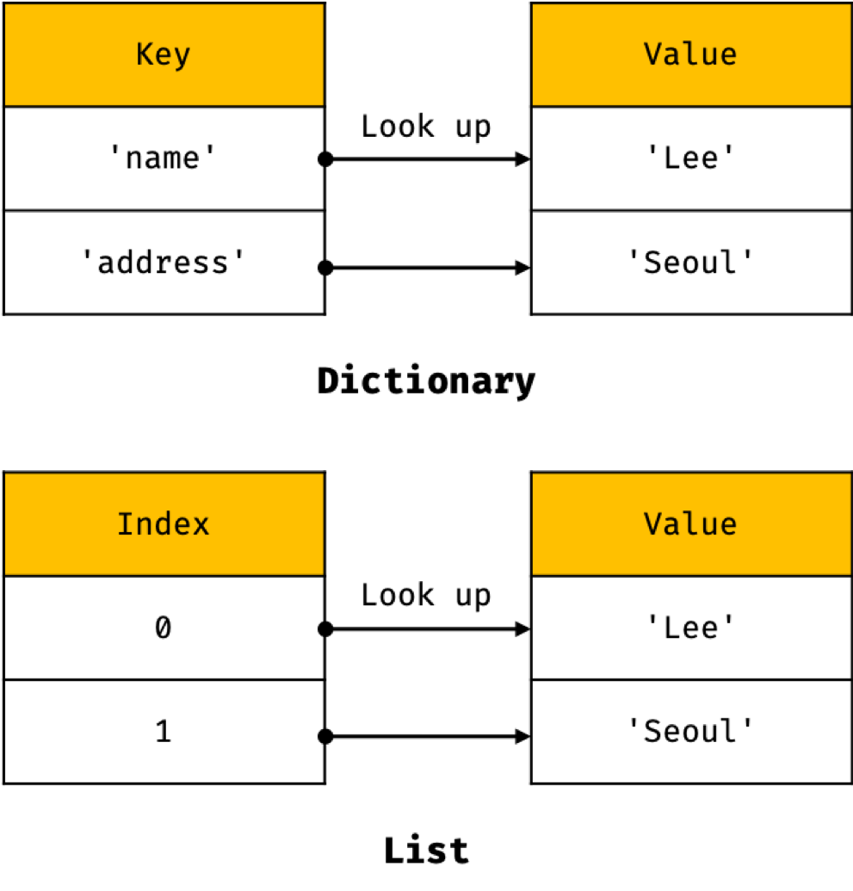

## 10. 원시 값과 객체의 비교

### 

### 1. 자바스크립트가 제공하는 데이터 타입

- 종류 : 

  1. 원시 타입
  2. 객체 타입

- 왜 구분해 놨을까?

  |      |                          원시 타입                           |                          객체 타입                           |
  | ---- | :----------------------------------------------------------: | :----------------------------------------------------------: |
  | 특징 |               원시 값은 변경 불가능한 값이다.                |                  객체는 변경 가능한 값이다.                  |
  |      |          변수에 할당하면 변수에는 실제 값이 저장됨           |           변수에 할당하면 변수에는 참조값이 저장됨           |
  |      | 변수를 변수에 할당하면 원본의 원시값이 복사되어 전달  (값에 의한 전달) | 변수를 다른 변수에 할당하면 원본의 참조 값이 복사되어 전달 (참조에 의한 전달) |

### 2. 원시값

- 특징 : 불변성 

  -> 따라서 변수가 재할당이 될때 기존 메모리 주소의 값이 변경불가능이니 새로운 메모리 공간을 할당받아 값을 입력하고 변수가 참조한다.

#### 2-1. 상수

정의 : 재할당이 금지된 변수

#### 2-2. 원시 타입별 메모리 공간의 크기

ECMAScript 사양에 원시 타입의 크기를 규정하고 있지 않음

따라서 원시 타입의 크기는 브라우저 제조사의 구현에 따라 다를수 있음

#### 2-3. 원시 값 문자열의 독특한 특징

1. 1개의 문자는 (문자의 개수 * 2) byte의 메모리 공간에 저장

2. 숫자 타입의 값은 1이든 10000이든 동일한 8byte가 필요함

3. 변수에 선언된 문자열은 불변한다 

   -> 따라서 생성된 문자열의 일부 문자를 변경해도 반영되지 않는다.

   

#### 2-4. 값에 의한 전달

정의 : 변수에 변수를 할당하는 경우, 할당되는 변수가 원시값을 갖는 변수라면 할당받는 변수에는 할당되는 변수의 원시값이 복사되어 전달된다. 

### 3. 객체 

특징 : 

1. 확보해야할 메모리 공간의 크기를 사전에 정해 둘 수 없다.
2. 변경 가능한 값
   - 변수에 객체를 할당했을때 
     - 순서 1 : 객체를 할당한 변수는 참조 값을 갖는다. (여기서 참조값은 생성된 객체가 저장된 메모리 공간의 주소 그 자체)
     - 순서 2 : 변수는 메모리 공간의 주소를 갖고 있고 그 주소안에 값은 객체가 실제로 저장된 메모리 공간의 주소가 저장되어있음. 
   -  ex) 
     - 1. 프로퍼티를 동적으로 추가할수 있음
       2. 프로퍼티 값을 갱신할 수 있음
       3. 프로퍼티 자체를 삭제할 수 있음
3. 참조에 의한 전달
   - 동작 : 객체를 가리키는 변수를 다른 변수에 할당하면 원본의 참조 값이 복사되어 전달된다.
   - 단점 : 원본 또는 사본 어느 한쪽에서 객체를 변경하면 서로 영향을 주고 받는다.

#### 3-1. 자바스크립트의 객체 관리 방식

모던 자바스크립트 엔진은 객체의 프로퍼티 값의 위치를 메모리에 저장하기 위해 해시 함수 기반의 유사 딕셔너리 구조를 사용한다.

하지만 

위 방식의 단점은 클래스 기반 객체 지향 프로그래밍 언어의 객체 관리 방식보다 더 비용이 많이 드는 비효율적인 방식

따라서 

V8 자바스크립트 엔진은 히든 클래스라는 방식을 사용

히든 클래스는 Java와 같이 고정된 객체 레이아웃과 유사하게 동작함

#### 