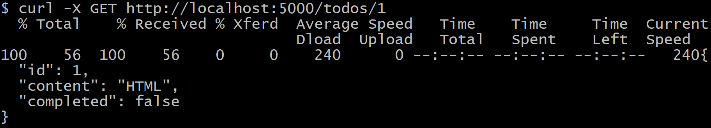

# 서버 공부

### 1. 의문점 

1. ```javascript
   const xhr = new XMLHttpRequest();
   xhr.open('GET', 'http://localhost:5000/todos');
   xhr.send();
   
   xhr.onreadystatechange = function(e) {
   	if(xhr.readyState !== XMLHttpRequest.DONE) return;
   	
   	if(xhr.status === 200) {
   		console.log(xhr.responseText);
   	} else{
   		console.log("Error!");
   	}
   }
   ```

   위 코드를 터미널 환경에서 실행시켰다.

   하지만 아래와 같은 에러가 생겼다.

   ```javascript
   const xhr = new XMLHttpRequest();
               ^
   
   ReferenceError: XMLHttpRequest is not defined
       at req (c:\Minjyo\pfolder\rest-api-exam\example.js:2:13)
       at Object.<anonymous> (c:\Minjyo\pfolder\rest-api-exam\example.js:18:1)
       at Module._compile (internal/modules/cjs/loader.js:945:30)
       at Object.Module._extensions..js (internal/modules/cjs/loader.js:962:10)
       at Module.load (internal/modules/cjs/loader.js:798:32)
       at Function.Module._load (internal/modules/cjs/loader.js:711:12)
       at Function.Module.runMain (internal/modules/cjs/loader.js:1014:10)
       at internal/main/run_main_module.js:17:11
   ```

   그 이유를 찾아보니 XMLHttpRequest는 Web API이기 때문에 node환경에서 실행이 안되는것

   따라서 아래와 같이 example.html을 live.server로 실행했더니 실행됨.

    

   ```html
   // example.html
   
   <!DOCTYPE html>
   <html lang="en">
   <head>
     <meta charset="UTF-8">
     <meta name="viewport" content="width=device-width, initial-scale=1.0">
     <meta http-equiv="X-UA-Compatible" content="ie=edge">
     <title>Document</title>
     <script src="example.js"></script>
   </head>
   <body>
     
   </body>
   </html>
   ```

   ```javascript
   // example.js
   
   const xhr = new XMLHttpRequest();
   xhr.open('GET', 'http://localhost:5000/todos');
   xhr.send();
   
   xhr.onreadystatechange = function(e) {
   	if(xhr.readyState !== XMLHttpRequest.DONE) return;
   	
   	if(xhr.status === 200) {
   		console.log(xhr.responseText);
   	} else{
   		console.log("Error!");
   	}
   }
   ```

   ```javascript
   // 결과
   [
       { "id": 1, "content": "HTML", "completed": false },
       { "id": 2, "content": "CSS", "completed": true },
       { "id": 3, "content": "Javascript", "completed": false }
   ]
   ```

   ---------

2. curl이 뭔가?

   ```javascript
   $ curl -X GET http://localhost:5000/todos/1
   ```

   브라우저에서 http://localhost:5000/todos/1주소를 입력하고 출력된값을 터미널에 출력해줌

   

   아래 그림은 GET 터미널 결과 사진임

   

   

   아래 그림은 POST 터미널 결과 사진임

   

