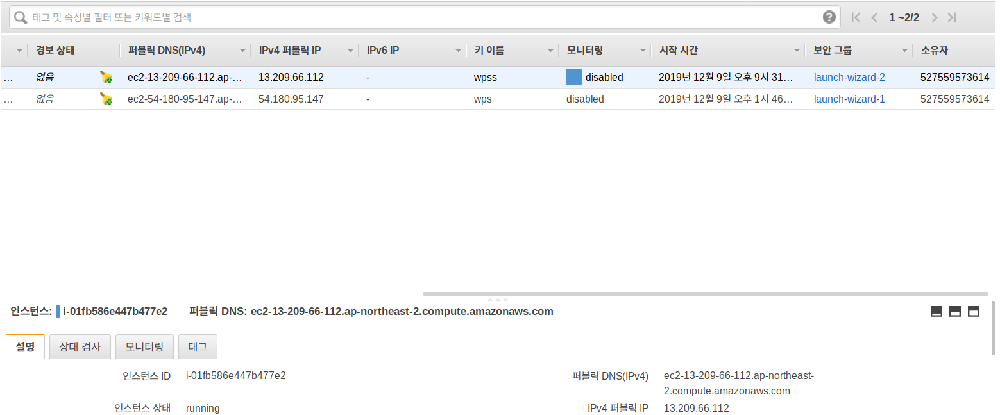
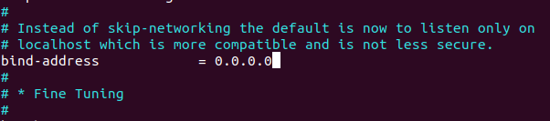
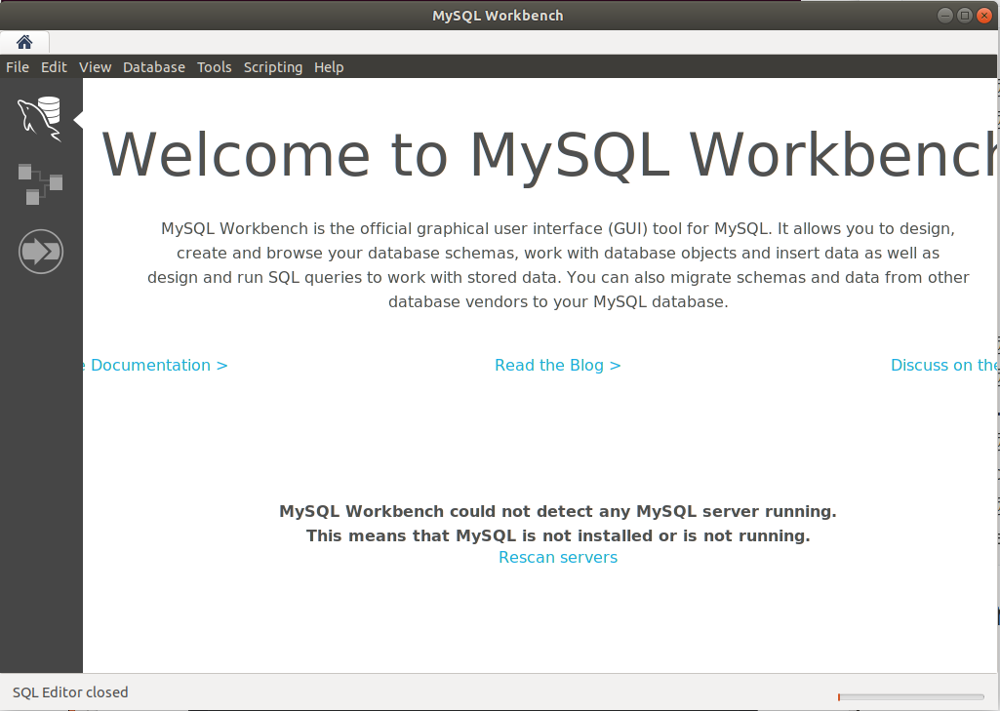
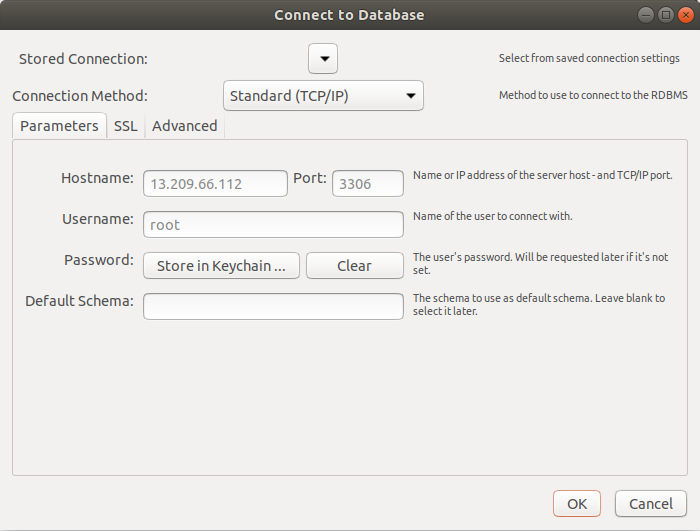
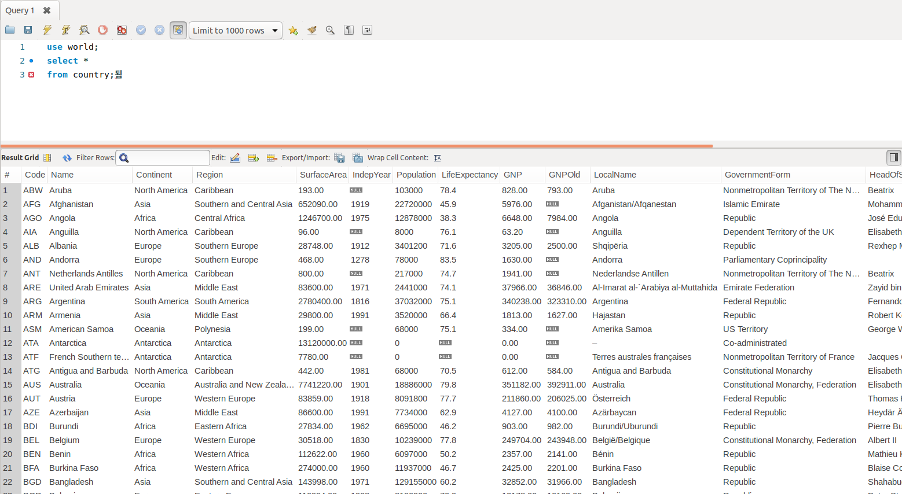

# 데이터베이스 1일차 수업

### 1. mysql workbench 다운로드

1. 주소 : `google에 mysql workbench download` 치고 다운


### 2. mysql 설치 및 설정

1. amazon web service site 들어간다.
2. 로그인을 한다.
3. AWS Management Concole 서비스 찾기 란에 EC2라고 입력한다.


4. EC2를 클릭한다.

5. `인스턴스` 클릭


6. `인스턴스 시작` 버튼 클릭
7. `Ubuntu Server 18.04 LTS (HVM), SSD Volume Type` 선택 클릭


8. 아래 사진에서 나온 부분(프리 티어 사용 가능) 체크하고 검토 및 시작 클릭


9. 보안 그룹 구성 클릭


10. 규칙 추가 클릭하고 아래 사진과 같이 양식 채우기


11. `검토 및 시작` 클릭

12. `시작하기` 클릭

13. `새 키 페어 생성` 선택 및 `키 페어 이름`을 만들고 `키 페어 다운로드` 클릭

    다운로드 된 경로(보통 download 폴더임) 기억하기


14. `인스턴스 시작` 클릭

15. `인스턴스 보기` 클릭

16. 터미널 열기

    ```bash
    $ mv ~/Downloads/wpss.pem ~/.ssh
    $ ls ~/.ssh
    <결과> wpss.pem
    $ chmod 400 ~/.ssh/wpss.pem
    $ ssh -i ~/.ssh/wpss.pem ubuntu@13.209.66.112
    ```

    13.209.66.112라는 숫자는 

    

    아래 사진처럼 `퍼블릭 DNS(IPv4)` 에서 확인할 수 있다.

    

```bash
$ sudo apt-get update -y
$ sudo apt-get upgrade -y
$ sudo apt-get install mysql-server
$ sudo mysql_secure_installation

<Question>
Would you like to setup VALIDATE PASSWORD plugin? N
New password: wpss
Re-enter new password: wpss
Remove anonymous users? Y
Disallow root login remotely? N
Remove test database and access to it? Y
Reload privilege tables now? Y

# MySQL 패스워드 설정
$ sudo mysql

mysql> SELECT user,authentication_string,plugin,host FROM mysql.user;

mysql> ALTER USER 'root'@'localhost' IDENTIFIED WITH mysql_native_password BY 'wpss';

mysql> FLUSH PRIVILEGES;

mysql> SELECT user,authentication_string,plugin,host FROM mysql.user;

mysql> exit

# 설정한 패스워드를 입력하여 접속
$ mysql -u root -p
Enter password: wpss

mysql> exit

# 외부접속 설정
$ sudo vi /etc/mysql/mysql.conf.d/mysqld.cnf
# bind-address를 127.0.0.1을 0.0.0.0 으로 변경
```



:wq로 저장하고 종료

```bash
# 외부접속 패스워드 설정
$ mysql -u root -p
mysql> grant all privileges on *.* to root@'%' identified by 'wpss';
mysql> exit
```

```bash
# 서버 시작 종료 상태 확인
$ sudo systemctl start mysql.service
$ sudo systemctl stop mysql.service
$ sudo systemctl restart mysql.service
$ sudo systemctl status mysql.service
# q로 나가기
```

```bash
# 설정 후 서버 재시작으로 설정 내용 적용
$ sudo systemctl restart mysql.service

# password 변경: wps로 패스워드를 변경하는 경우
mysql> ALTER USER 'root'@'localhost' IDENTIFIED BY 'wps';
```

```bash
# 서버로 sql 파일을 전송
minjyo@min:~$ scp -i ~/.ssh/wpss.pem ~/Documents/database_book/wps_database/datas/* ubuntu@13.209.66.112:~/

<결과>
employees.sql                                                     100%  116MB   1.1MB/s   01:42    
sakila-data.sql                                                   100% 3319KB   1.1MB/s   00:02    
sakila-schema.sql                                                 100%   23KB 810.8KB/s   00:00    
world.sql                                                         100%  388KB   1.1MB/s   00:00
```

```bash
# 데이터 베이스 생성
minjyo@min:~$ ssh -i ~/.ssh/wpss.pem ubuntu@13.209.66.112
ubuntu@ip-172-31-41-171:~$ mysql -u root -p
mysql> create database world;
mysql> create database sakila;
mysql> create database employees;
mysql> quit

# 데이터 베이스에 데이터 추가
ubuntu@ip-172-31-41-171:~$ mysql -u root -p world < world.sql
ubuntu@ip-172-31-41-171:~$ mysql -u root -p sakila < sakila-schema.sql
ubuntu@ip-172-31-41-171:~$ mysql -u root -p sakila < sakila-data.sql
ubuntu@ip-172-31-41-171:~$ mysql -u root -p employees < employees.sql
```

### 3. Workbench를 이용한 접속해서 코드 테스트하기



1. Database 버튼 클릭
2. Connect to Database 클릭



3. Hostname에 `퍼블릭 DNS(IPv4)`주소 쓰기
4. PORT는 인스턴스를 생성할때의 포트를 적어주기
5. Store in Keychain 클릭해서 설정했던 비밀번호 입력하기

6. ok버튼 클릭

7. 생성된 파일에 코드를 쓰고 번개 모양 누르면 결과가 아래 출력됨



8. 예제

```
mysql -u root -p

mysql> use world;
mysql> select *
    -> from country;

mysql> select * 
    -> from city;

mysql> select *
    -> from countrylanguage;
    
mysql> select * 
    -> from country;
    
# 컬럼 이름 선택해서 가져올수 잇음
mysql> select Code, population, continent
    -> from country;   
    
mysql> select * 
    -> from country;  
    
mysql> select * 
    -> from country
    -> where population >= 100000000; 
    
mysql> select *
    -> from country
    -> where population <= 100000000
    -> AND population >= 70000000;  
    
mysql> select *
    -> from country
    -> where population between 70000000 and 100000000;  
    
mysql> select *
    -> from country
    -> where continent = "Asia"
    -> or continent = "africa";   
    
mysql> select *
    -> from country
    -> where continent = "Asia"
    -> or continent = "africa";  
    
mysql> select * 
    -> from country
    -> where continent in ("Asia", "Africa");    
    
mysql> select * 
    -> from country
    -> where continent not in ("Asia", "Africa"); 
    
mysql> select * 
    -> from country
    -> where Region like "%Europe";   
    
mysql> select * 
    -> from country
    -> where Region like "Europe%";  
    
# 정렬
mysql> select * 
    -> from country
    -> where Region like "%Europe";   
    
mysql> select name, population
    -> from country
    -> order by population DESC; 
    
mysql> select name, population
    -> from country
    -> where population between 70000000 and 100000000
    -> order by population DESC;  
    
mysql> select name, population
    -> from city
    -> order by CountryCode ASC; 
    
mysql> select CountryCode, name, population
    -> from city
    -> order by CountryCode ASC; 
    
mysql> select CountryCode, name, population
    -> from city
    -> order by CountryCode ASC; 
    
limit
인구가 가장 많은 국가 5개를 출력
mysql> select code, name, population 
    -> from country
    -> order by population desc
    -> limit 5;    
    
mysql> select code, name, population 
    -> from country
    -> order by population desc
    -> limit 5, 3;
    
# 함수 사용법 : 90% 이상 사용되는 언어 출력
mysql> select *
    -> from countrylanguage
    -> where percentage >= 90
    -> order by language;    
    
# 중복된 데이터 제거
mysql> select distinct(language)
    -> from country language
    -> where percentage >= 99
    -> order by language;  
    
mysql> use sakila;
    -> use world;
	-> select distinct(language), percentage
	-> from countrylanguage
	-> where percentage >= 99
	-> order by language    
    
# 함수 사용법 : 99% 이상 사용되는 언어의 갯수 출력    
mysql> select count(language)
    -> from countrylanguage
    -> where percentage >= 99
    -> order by language;    
    
mysql> select count(distinct(language)) 
    -> from countrylanguage
    -> where percentage >= 99
    -> order by language;  
```

---------

quiz 1

1. country 테이블에서 중복을 제거한 Continent를 조회하세요.

```mysql
mysql> select distinct(continent) as continent_count
    -> from country;
```

2. Sakila 데이터 베이스에서 국가가 인도 고객의 수를 출력하세요.

```mysql
mysql> use sakila

mysql> select *
    -> from customer_list;

mysql> select country
    -> from customer_list
    -> where country = "India"; 

mysql> select country, count(country) as count
    -> from customer_list
    -> where country = "India";
```

3. 한국 도시중에 인구가 100만이 넘는 도시를 조회하여 인구순으로 내림차순하세요.

```
mysql> select *
	-> from city
	-> where countrycode = "KOR" and population > 1000000
```

4. city 테이블에서 population이 800만 ~ 1000만 사이인 도시 데이터를 인구수순으로 내림차순하세요.

```
mysql> use world;
	-> select *
    -> from city
    -> where population between 8000000 and 10000000;

mysql> use world;
	-> select *
    -> from city
    -> where population between 8000000 and 10000000
    -> order by population desc;    
```

-----

select 부가 설명

```
select 10 as number, 10/5 as div_number
from dual

# 국가 데이터에서 인구당 GNP 순위를 내림차순으로 출력
select code, name, population, GNP
from country

select code, name, population, GNP, (GNP/population)*100 as gpp from country
order by gpp desc
```

-----

GROUP BY HAVING

```mysql
# GROUP BY HAVING mysql예제
# group by : count, max, min, avg, var_samp(표준편차), stddev(분산)\
# city 테이블에서 국가별 도시의 갯수를 출력
select countrycode
from city

mysql> select countrycode
    -> from city
    -> group by countrycode;
    
mysql> select countrycode, count(countrycode)
    -> from city
    -> group by countrycode;  
    
# 대륙별 인구수와 GNP 최대값을 조회
mysql> select * 
    -> from country;

mysql> select continent, population, GNP
    -> from country;

mysql> select continent, max(population), max(GNP)
    -> from country
    -> group by continent;
    
mysql> select continent, avg(population), min(GNP)
    -> from country
    -> group by continent;

mysql> select continent, avg(population), min(GNP)
    -> from country
    -> where GNP > 0
    -> group by continent;
    
mysql> select continent , avg(population) as avg_population, min(GNP) as min_gnp
    -> from country
    -> where GNP > 0
    -> group by continent;   
    
// 에러뜨는 이유 찾아봐
mysql> select continent , avg(population) as avg_population , min(GNP) as min_gnp
    -> from country
    -> where GNP > 0 and min_gnp > 100
    -> group by continent

mysql> select continent , avg(population) as avg_population , min(GNP) as min_gnp
    -> from country
    -> where GNP > 0
    -> group by continent
    -> having min_gnp > 100
    -> order by min_gnp desc
    -> limit 1;   
    
mysql> use sakila

# 고객과 스탭별 매출과 고객별 매출 총합
mysql> select * 
    -> from payment;
    
mysql> select *
    -> from payment
    -> group by customer_id, staff_id;

mysql> select customer_id, staff_id, sum(amount)
    -> from payment
    -> group by customer_id, staff_id;

mysql> select customer_id, staff_id, sum(amount)
    -> from payment
    -> group by customer_id, staff_id
    -> with rollup;
    
```

