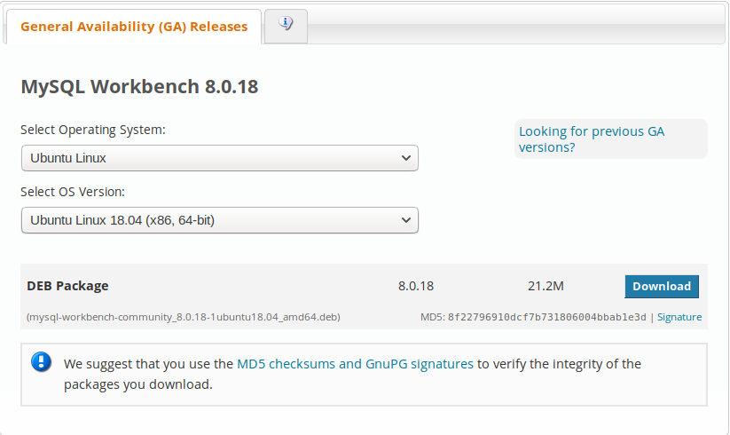
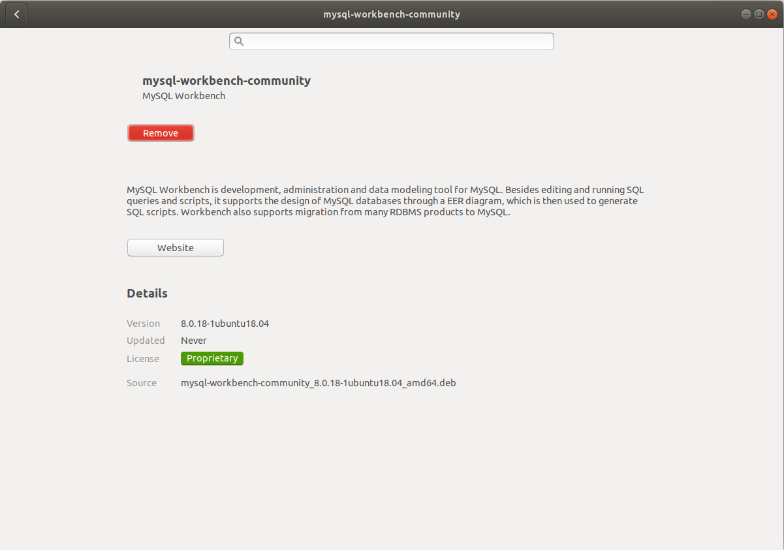
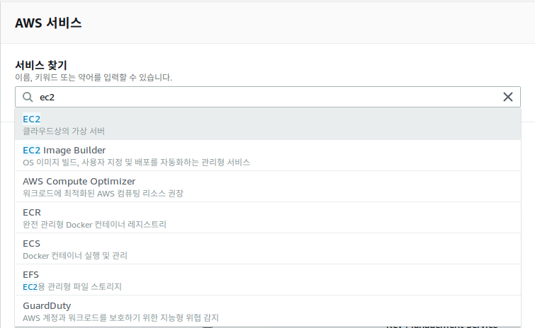
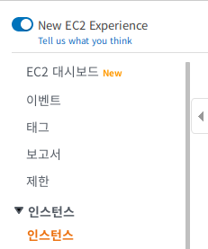
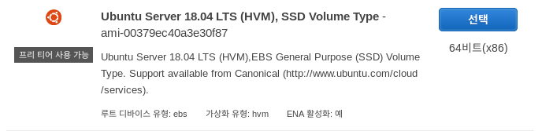
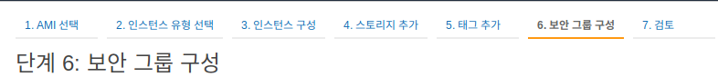
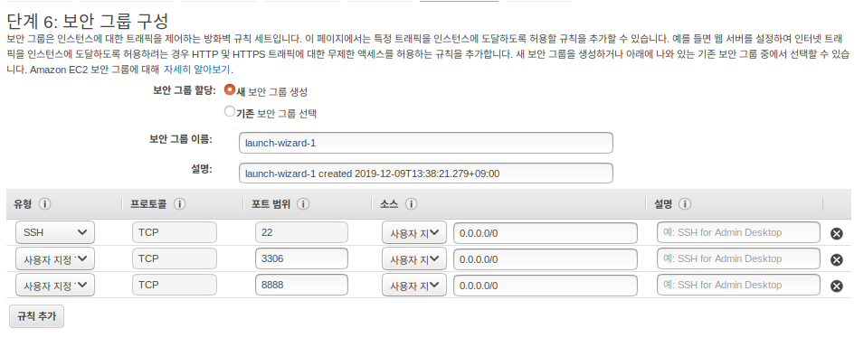
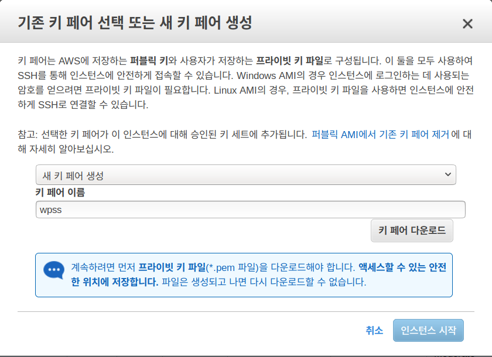

데이터베이스 1일차 수업

### 1. mysql workbench 다운로드

1. 주소 : `google에 mysql workbench download` 치고 다운

### 2. mysql 설치 및 설정

1. amazon web service site 들어간다.
2. 로그인을 한다.
3. AWS Management Concole 서비스 찾기 란에 EC2라고 입력한다.

4. EC2를 클릭한다.

5. `인스턴스` 클릭

6. `인스턴스 시작` 버튼 클릭
7. `Ubuntu Server 18.04 LTS (HVM), SSD Volume Type` 선택 클릭

8. 아래 사진에서 나온 부분(프리 티어 사용 가능) 체크하고 검토 및 시작 클릭

9. 보안 그룹 구성 클릭

10. 규칙 추가 클릭하고 아래 사진과 같이 양식 채우기

11. `검토 및 시작` 클릭

12. `시작하기` 클릭

13. `새 키 페어 생성` 선택 및 `키 페어 이름`을 만들고 `키 페어 다운로드` 클릭

    다운로드 된 경로(보통 download 폴더임) 기억하기

14. `인스턴스 시작` 클릭
15. `인스턴스 보기` 클릭
16. 터미널 열기

