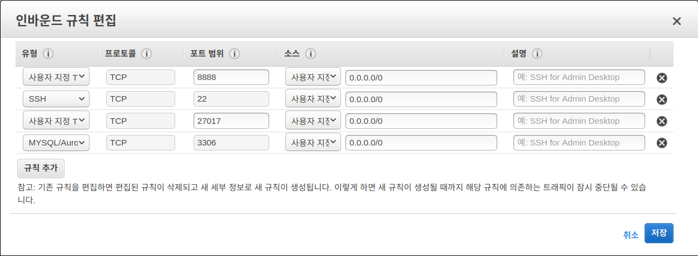
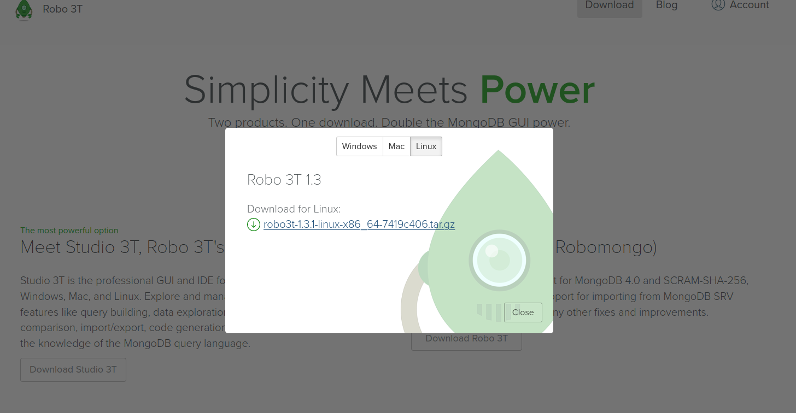
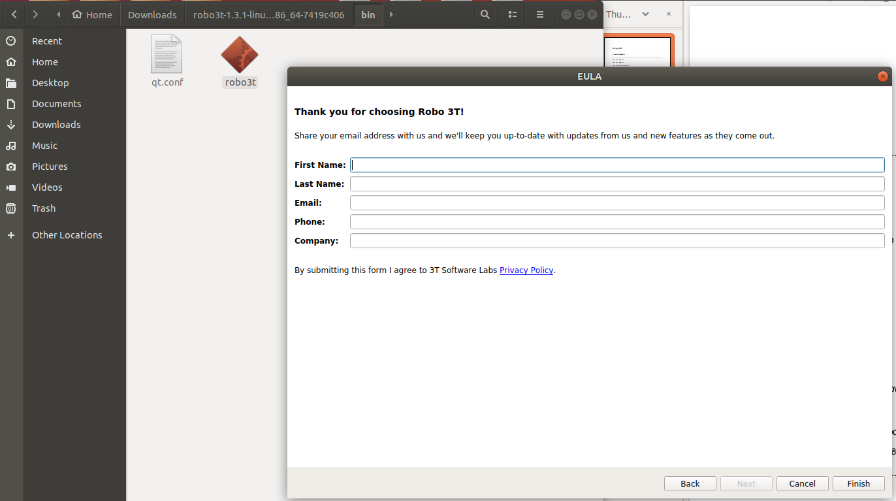
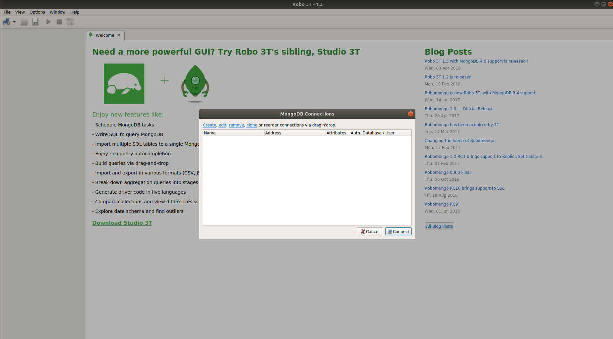
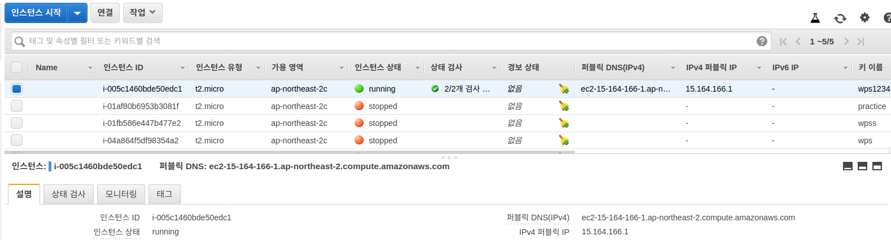
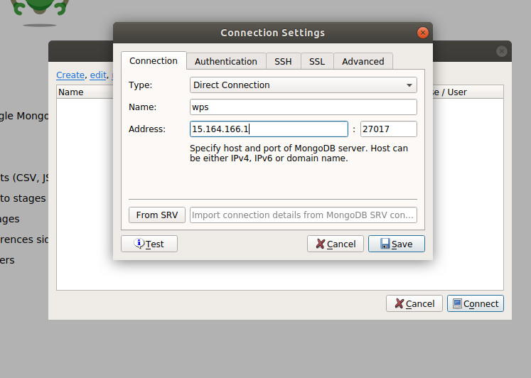
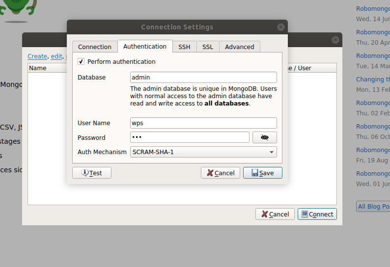
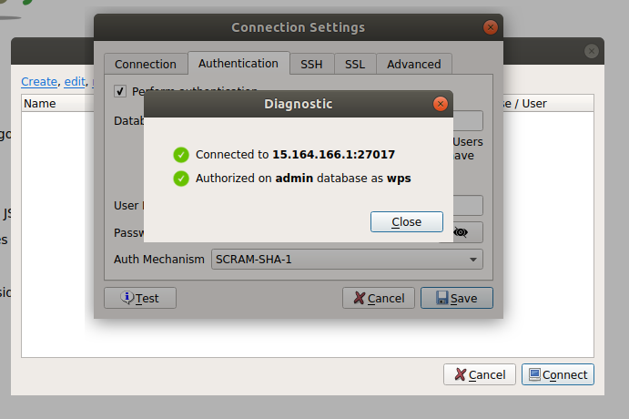
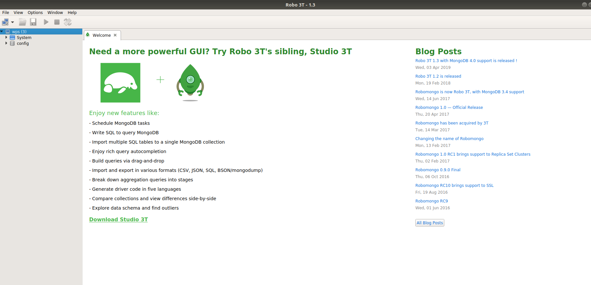

데이터베이스 day_4.pdf

03_pymongo

04_pymongo_zigbang

가지고 공부함

---

서버 컴퓨터에 접속

```bash
minjyo@min:~$ ssh -i ~/.ssh/wps1234.pem ubuntu@15.164.166.1
(python3) ubuntu@ip-172-31-37-221:~$ sudo apt update -y
(python3) ubuntu@ip-172-31-37-221:~$ sudo apt update -y
(python3) ubuntu@ip-172-31-37-221:~$ sudo apt autoremove libdumbnet1
(python3) ubuntu@ip-172-31-37-221:~$ sudo apt upgrade -y
(python3) ubuntu@ip-172-31-37-221:~$ sudo apt install -y mongodb
(python3) ubuntu@ip-172-31-37-221:~$ sudo systemctl status mongodb
알파벳 q로 exit
(python3) ubuntu@ip-172-31-37-221:~$ sudo vi /etc/mongodb.conf
```

위 명령어 까지 치면 /etc/mongodb.conf 파일이 생기는데

```
bind_ip = 0.0.0.0
auth = true
```

로 설정

```bash
$ mongo
> use.admin

# db.createUser({user:"아이디로 지정하고 싶은것", pwd:"비밀번호로 지정하고 싶은것", roles:["root"]})
> db.createUser({user:"myid", pwd:"mypassword",roles:["root"]})
> quit()
(python3) ubuntu@ip-172-31-37-221:~$ sudo vi /etc/mongodb.conf
```

이렇게 설정하고 로보 몽고를 통해 서버에 접속해볼꺼임


아마존 웹서비스 ec2에 들어가서 인스턴스를 클릭후 - 보안그룹 클릭- 인바운드 클릭- 편집 클릭



위 사진과 같이 만들어준다. (27017이 되어있는줄 포함되어있어야됨)


https://robomongo.org/download 에 들어가서 오른쪽 아래 있는 Robo 3T 클릭 다운로드




다운로드 받은 파일을 Extract하고 bin파일에 들어가 보면 robo3t있음. robo3t 클릭



별로 중요하지 않은 칸임 , 아무거나 채워넣고 finish 클릭


finish 클릭 버튼 누르면



이 창이 뜬다.

이 창에서 create버튼을 클릭한후 

아래 사진과 같이 양식을 채워준다.

아래 사진에서 Name은 

```
> db.createUser({user:"myid", pwd:"mypassword",roles:["root"]})
```

칸에서 채웠던 myid를 넣어주고 

Address에는 



IPv4 퍼블릭 IP 값으로 채워준다.




Authentication 메뉴에서는 



Database : admin

User Name과 password에는

```
> db.createUser({user:"myid", pwd:"mypassword",roles:["root"]})
```

칸에서 채웠던 myid와 mypassword를 채워주고

Test button클릭하면 아래와 같은 사진이 나온다.



save 버튼을 누르고 나오면

아래와 같은 사진이 나옴





wps 오른쪽 클릭 후 open shell 클릭

재생표시가 실행표시임

여기서 config 가 데이터베이스임


데이터베이스를 만들때 생성되는게 아니라 어떤 데이터를 넣을때 데이터베이스가 생긴다.


여기서 

컬렉션이란? : mysql에서 테이블

도큐먼트란? : mysql에서 row


# 4. Basic Syntax

https://docs.mongodb.com/v3.6/reference/


## 4.1 Create Database

---

### mongo 라는 이름의 데이터 베이스 생성

```
use mongo
```


### 현재 사용중인 데이터 베이스 확인

```
db
```


### database list 확인

```
show dbs
```


- 데이터 베에스를 생성후에 최소 1개이상의 document를 추가해야 생성된 데이터 베이스가 보
  입니다.

### document 생성

```
use mongo
db.user.insert({"name":"alice", "age":20, "email":"alice@gmail.com"})

```


---

## 4.2 Delete Database

### 현재 사용중인 데이터 베이스 삭제

db.dropDatabase()


## 4.3 Create Collection

reference

- https://docs.mongodb.com/v3.6/reference/method/db.createCollection/

### # name : collection 이름

```
db.createCollection(name, [option])

```

option

- capped : true로 설정하면 collection의 최대 용량을 설정 (최대 용량의 크기는 size 옵션으로
  설정), 설정된 최대용량 이상으로 데이터가 입력되면 오래된 데이터 부터 자동으로 삭제됩니다.

- autoIndex : true로 설정하면 _id 필드에 index가 자동으로 생성됩니다.
- size : 숫자 데이터를 사용하며 collection의 최대 사이즈를 byte 단위로 지정
- max : 숫자 데이터를 사용하며 최대 document 갯수를 설정


### # user 컬렉션을 생성

```
db.createCollection("user")

```


### # autoIndex와 max 옵션을 설정하여 info 컬렉션을 생성

```
db.createCollection("info1", { autoIndexId: true, capped: true, size: 500, max:5 })
db.createCollection("info2", { autoIndexId: true, capped: true, size: 50, max:5 })

### 

```

### # createCollection을 사용하지 않고 article 컬렉션을 생성

```
db.articles.insert( {"title":"data science", "contents":"mongodb" } )

```


### # 컬렉션 리스트 확인

```
show collections


```


## 4.4 Delete Collection

### # articles 컬렉션 삭제

```
db.articles.drop()

```


## 4.5 Make Document

```
db.<collection_name>.insert(<document>)

```


### # info 컬렉션에 document 추가

```
db.info1.insert({ "subject":"python", "level":3 })
db.info1.insert({ "subject":"web", "level":1 })
db.info1.insert({ "subject":"sql", "level":2 })

```


### # 한번에 여러개의 document 추가

### # max:5 옵션 제한에 걸려 5개의 데이터가 info1에 들어간다.

```
db.info1.insert( [
{ "subject":"python", "level":3 },
{ "subject":"web", "level":1 },
{ "subject":"sql", "level":2 },
{ "subject":"python", "level":3 },
{ "subject":"web", "level":1 },
{ "subject":"sql", "level":2 },
])

```


### # size:50 옵션 제한에 걸려 4개의 데이터가 info2에 입력된다.

```
db.info2.insert( [
{ "subject":"python", "level":3 },
{ "subject":"web", "level":1 },
{ "subject":"sql", "level":2 },
{ "subject":"python", "level":3 },
{ "subject":"web", "level":1 },
])

```

```
db.info.insert( [
{ "subject":"python", "level":3 },
{ "subject":"web", "level":1 },
{ "subject":"sql", "level":2 },
{ "subject":"java", "level":3 },
{ "subject":"html", "level":1 },
{ "subject":"css", "level":2 },
])

```

---

## 4.6 Delete Document

### level2인 데이터 삭제 : 제약조건이 걸려있는 컬렉션의 도큐먼트는 삭제가 안됩니다.

```
db.info.remove( {level:2} )

```


## 4.7 Find

reference
https://docs.mongodb.com/manual/reference/method/db.collection.find/index.html

format
db.collection.find(query, projection)
query : document 조회 조건을 설정. 모든 document를 조회 할때는 ({})를 사용
projection : document를 조회할때 보여지는 필드(컬럼)를 정의

### 4.7.1 query


4.7.1.1 기본 document 조회


### # info 컬렉션에 있는 모든 document 조회

```
db.info.find()
db.getCollection('info').find({})

```


### # subject가 python인 document 조회

db.info.find({"subject": "python"})


### 4.7.1.2 비교 연산자

reference

- https://docs.mongodb.com/v3.6/reference/operator/query/


### # level이 2 이하인 document를 조회

```
db.info.find({"level": {$lte: 2} })

```

### # level이 3 이상인 document를 조회

```
db.info.find({"level": {$gte: 3} })

```

### #subject가 java와 python을 포함하는 document 조회

```
db.info.find( {"subject": {$in: ["java", "python"]}} )

```

## 4.7.1.3 논리 연산자

$or : 조건중 하나라도 true이면 true
$and : 모든 조건이 true이면 true
$not : 조건중 하나라도 false이면 true
$nor : 모든 조건이 false이면 true (or와 반대 개념)


### # subject가 python이고 level이 3이상인 document 조회

```
db.info.find({ $and: [ { "subject":"python" }, { "level": {$gte: 3} } ] })

```


### # subject가 python이아니고 level이 1이하가 아닌 document 조회

```
db.info.find({ $nor: [ { "subject":"python" }, { "level": {$lte: 1} } ] })

```


### # level이 2보다 크지 않은 document 조회 (2 포함)

db.info.find({ "level": { $not: {$gt: 2} } })


## 4.7.1.4 $where


$where 연산자를 사용하면 자바스크립트 표현식 사용이 가능합니다.


### # level이 1인 document 조회

db.info.find( { $where: "this.level == 1"} )


## 4.7.2 projection

document를 조회할때 보여지는 필드(컬럼)를 정의합니다.


## 4.7.2.1 Basic

### subject와 comments만 출력되도록 find

### 설정을 true 값을 설정하던가 false 값을 설정합니다. ( _id는 따로 설정을 안하면 true )

db.info.find({},{"_id":false, "level":false})
db.info.find({},{"subject":true, "level":true})
db.info.find({},{"_id":false, "subject":true, "level":true})

## 4.8 Find Method

find method를 사용하면 find를 사용한 document의 결과를 가공하여 출력할수 있습니다.

## 4.8.1 sort

document를 정렬시켜 줍니다.
'sort({key: value})' 와 같은 포멧으로 사용을 하며 key는 정렬할 필드명을 작성하고, value는
오름차순은 1, 내림차순을 -1을 넣어주면 됩니다.

### # info 컬렉션의 document를 level 오름차순으로 정렬

```
db.info.find().sort({"level":1})

```


### # info 컬렉션의 document를 level 내림차순으로 정렬

```
db.info.find().sort({"level":-1})

```


### # level을 기준으로 내림차순으로 정렬한 후 subject를 기준으로 오름차순으로 정렬

```
db.info.find().sort({"level":-1, "subject":1})

```

## 4.8.2 limit

limit을 사용하면 document출력 결과의 수룰 제한할수 있습니다.

### # document의 결과를 3개 까지만 출력

```
db.info.find().limit(3)

```


### # document의 결과를 level로 내림차순으로 정렬하고 3개까지만 출력

db.info.find().sort({"level":-1}).limit(3)

## 4.8.3 skip

skip을 검색한 document의 결과의 시작부분을 설정할때 사용합니다.

### # document를 3번째 부터 출력

db.info.find().skip(2)

* limit, skip을 함께 사용해서 mysql의 limit과 같이 사용할수 있습니다.

  

  ## 4.9 update

  

  reference

- https://docs.mongodb.com/manual/reference/command/update/index.html

  db.collection.update( query, update, { upsert: <bool>, multi: <bool> })

  upsert : insert와 update의 합성어 (데이터가 있으면 update, 없으면 insert 한다는 의미)

  multi : true로 설정되면 여려개의 document를 수정합니다. 기본값은 false

### # 특정 document를 새로운 document로 수정하기

```
db.info.update(
{ "subject": "html" },
{ "subject": "sass", "level":2}
)

```

db.info.update(
{ "subject": "less" },
{ "subject": "less", "level": 2},
{ "upsert": true}
)


## 4.9.1 $set, $unset

$set을 사용하면 특정 document의 필드를 수정할수 있습니다.
$unset를 사용하면 특정 document의 필드 제거할수 있습니다.


### # python의 level을 3으로 수정 (한개의 데이터만 수정)

db.info.update( { subject: "java" }, { $set: { level: 4 } } )

### # level 2를 level 1로 수정 (여러개의 데이터 수정)

```
db.info.update(
{ level: 2 },
{ $set: { level: 1 } },
{ multi: true }
)

```


### # subject가 sass인 document의 level필드 삭제

```
db.info.update(
{ subject: "sass" },
{ $unset: {level: 1} }
)

```


* level: 1의 1은 true를 의미합니다.

### # level이 2이하인 데이터를 1로 수정하기

```
db.info.update(
{ level: {$lte: 2} },
{ $set: {level: 1} },
{ multi: 1 }
)

```


### # level이 없는 데이터 level 추가하기

```
db.info.update(
{ level: {$exists: false} },
{ $set: {level: 2} },
{ multi: 1 }
)

```


## 4.10 Function

자바스크립트 문법으로 함수 작성이 가능합니다.

### skip 함수

```
var showSkip = function(start){
return db.info.find().skip(start)
}
showSkip(3)

```

---

# tip

서버에서 파일을 가지고 오고 보내고 하려면 

scp 명령어를 사용하거나 FileZilla 를 사용해야한다. https://filezilla-project.org/

