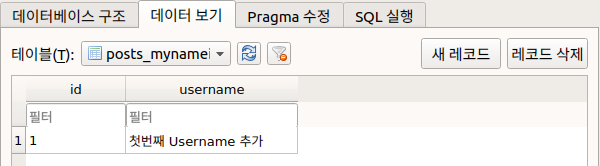
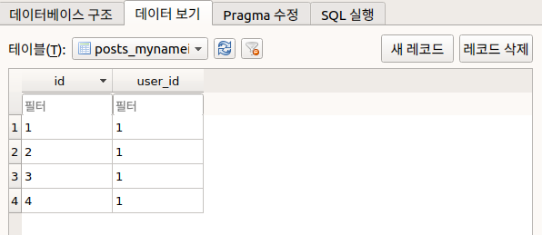

# related_name을 쓰는 방법


### 1. 어떨때 쓰는가?

related_name은 1:N의 관계에 있는 모델 A:B 에서 

A 모델 인스턴스가 관계된 B모델의 객체들을 불러올때 사용하는 

변수이다.


이는 모델 인스턴스의 속성 처럼 활용이 가능하며,

Queryset의 kwarg로도 활용이 가능하다.


### 2. related_name을 생성할때 알아야 할것

1. ForeignKey로 연결시켜 놓은 클래스에 related_name = comment라고 해놓으면

   user.comment라는 것이 comment모델에 생기는 것이 아니라 user모델에 생긴다.


2. 따라서 참조해준 객체 입장에서 related_name을 설정해줘야 한다.


### 3. related_name 예제





```python
# models.py
class MyNameIsUser(models.Model):
    username = models.TextField(max_length=50, 
                               blank=True
                               )
    
class MyNameIsComment(models.Model):
    user = models.ForeignKey(MyNameIsUser,
                             on_delete=models.CASCADE,
                             null=True,
                             related_name='comment',
                            )
                       
```

```shell
# shell_plus
# shell_plus
In[1] : user = MyNameIsUser.objects.get(pk=1)
In[2] : user
Out[2]: <MyNameIsUser: MyNameIsUser object (1)>
In[3] : user.comment.all()
Out[3]: <QuerySet [<MyNameIsComment: MyNameIsComment object (1)>, <MyNameIsComment: MyNameIsComment object (2)>, <MyNameIsComment: MyNameIsComment object (3)>, <MyNameIsComment: MyNameIsComment object (4)>]>
```

